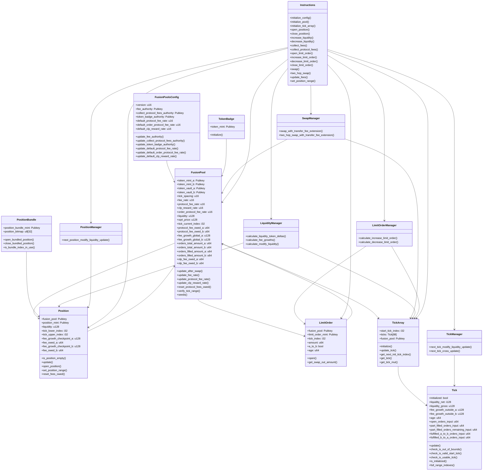
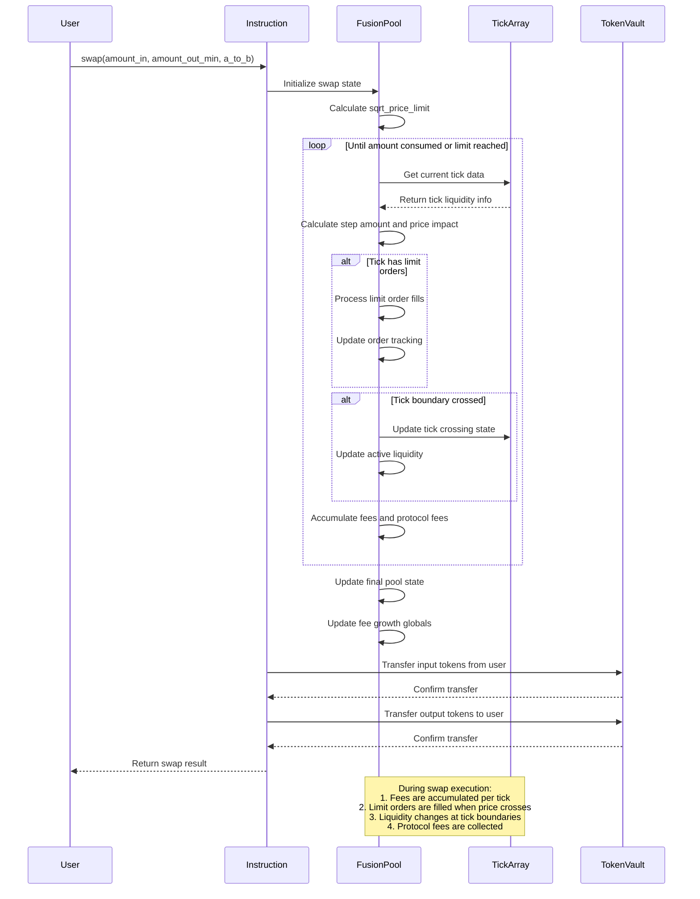

# FUSIONAMM Audit Report

<div align="center">

</div>

**Authors:**  
- David P – david@oshield.io  
- BlueWolf – wolf@oshield.io
- Mikb – mika@oshield.io

## Executive Summary

OShield performed a comprehensive security audit of the FusionAMM protocol, a decentralized automated market maker (AMM) on the Solana blockchain featuring concentrated liquidity and limit order functionality. The audit identified 4 vulnerabilities: 2 critical-severity issues [FUSIONAMM-C1: Incorrect Take Order Placement in Limit Order Manager](#FUSIONAMM-C1-Incorrect-Take-Order-Placement-in-Limit-Order-Manager), [FUSIONAMM-C2: Tick Uninitialization Leading to Limit Order Failures](#FUSIONAMM-C2-Tick-Uninitialization-Leading-to-Limit-Order-Failures), 1 high-severity issue [FUSIONAMM-H1:  Infinite Protocol Fee Collection](#FUSIONAMM-H1-Infinite-Protocol-Fee-Collection),and 1 low-severity issue [FUSIONAMM-L1: Token Badge Seed Mismatch](#FUSIONAMM-L1-Token-Badge-Seed-Mismatch). The critical-severity issues pose an immediate threat to protocol funds, while the high-severity arithmetic vulnerability could lead to permanent pool corruption affecting all users.
The audit employed a systematic methodology including semantic code analysis, vulnerability pattern recognition, comparative analysis with established protocols (Orca Whirlpools), and edge case testing. Particular attention was given to fee collection mechanisms, limit order accounting, and token extension compatibility. OShield's recommendations focus on implementing proper account constraints, checked arithmetic operations, and robust validation mechanisms to ensure FusionAMM's security and reliability within the Solana DeFi ecosystem.

## Table of Contents
- [HYPERION DEX-V3 Audit Report](#FUSIONAMM-audit-report)
	- [Table of Contents](#table-of-contents)
	- [1. Introduction](#1-introduction)
	- [2. Findings \& Recommendations](#2-findings--recommendations)
		- [2.1. Findings Summary](#21-findings-summary)
		- [2.2. Findings Description](#22-findings-description)
			- [FUSIONAMM-C1: Incorrect Take Order Placement in Limit Order Manager](#FUSIONAMM-C1-Incorrect-Take-Order-Placement-in-Limit-Order-Manager)
			- [FUSIONAMM-C2: Tick Uninitialization Leading to Limit Order Failures](#FUSIONAMM-C2-Tick-Uninitialization-Leading-to-Limit-Order-Failures)
  			- [FUSIONAMM-H1:  Infinite Protocol Fee Collection](#FUSIONAMM-H1-Infinite-Protocol-Fee-Collection)
			- [FUSIONAMM-L1: Token Badge Seed Mismatch](#FUSIONAMM-L1-Token-Badge-Seed-Mismatch)
	- [3. Protocol Overview](#3-protocol-overview)
		- [3.1 Program Charts](#31-program-charts)
			- [DEX-V3 Structure](#FusionAMM-structure)
			- [Swap Execution](#swap-execution)
	- [4. Methodology](#4-methodology)
 	- [5 Formal Verification](#5-formal-verification)
	- [6. Scope and Objectives](#6-scope-and-objectives)
		- [Repository Information](#repository-information)


## 1. Introduction
This audit focuses on FusionAMM, a concentrated liquidity automated market maker (AMM) built natively for Solana. FusionAMM leverages Solana's high throughput and low latency to provide efficient trading through an advanced AMM system that combines concentrated liquidity positions with integrated limit order functionality. The protocol implements tick-based price ranges, multiple fee tiers, and sophisticated order management to optimize capital efficiency and trading experience.

This audit included a comprehensive review of the protocol's smart contract code with particular attention to economic vulnerabilities, arithmetic safety, state management, and security implications of token interactions. Special focus was placed on the protocol's fee collection mechanisms, limit order execution logic, and tick management systems. FusionAMM represents an important infrastructure component for the Solana DeFi ecosystem, and ensuring its security and correctness is critical for both the protocol and its users. The audit was conducted with close collaboration from the FusionAMM development team, who proactively identified and reported issues encountered during their own testing, demonstrating their commitment to security and transparency.

## 2. Findings & Recommendations
Our severity classification system adheres to the criteria outlined here.

| Severity Level | Exploitability | Potential Impact | Examples |
|----------------|----------------|------------------|-----------|
| 🔴 Critical | Low to moderate difficulty, 3rd-party attacker | Irreparable financial harm | Direct theft of funds, permanent freezing of tokens/NFTs |
| 🟠 High | High difficulty, external attacker or specific user interactions | Recoverable financial harm | Temporary freezing of assets |
| 🟡 Medium | Unexpected behavior, potential for misuse | Limited to no financial harm, non-critical disruption | Escalation of non-sensitive privilege, program malfunctions |
| 🔵 Low | Implementation variance, uncommon scenarios | Zero financial implications, minor inconvenience | Program crashes in rare situations |
| ℹ️ Informational | N/A | Recommendations for improvement | Design enhancements, best practices |

### 2.1. Findings Summary

| Finding | Description | Severity Level |
|---------|-------------|----------------|
| [FUSIONAMM-C1]| Incorrect Take Order Placement in Limit Order Manager | 🔴 Critical |
| [FUSIONAMM-C2]| Tick Uninitialization Leading to Limit Order Failures | 🔴 Critical |
| [FUSIONAMM-H1]| Infinite Protocol Fee Collection | 🟠 High |
| [FUSIONAMM-L1]| Token Badge Seed Mismatch | 🔵 Low |


### 2.2. Findings Description

#### FUSIONAMM-H1: Infinite Protocol Fee Collectio

##### Description

The `fusion_pool` account in the `CollectProtocolFees` instruction is missing the `#[account(mut)]` constraint, preventing pool state changes from persisting to the blockchain.

```rust
pub fusion_pool: Box<Account<'info, FusionPool>>,  // Missing #[account(mut)]
```
As trading continues, protocol fees accumulate normally, but each collection call drains the previously "collected" amount plus any new fees. Repeated calls will systematically empty the entire pool vault balance.

##### Impact

• **Complete pool drainage**: Protocol authority will systematically drain entire pool vault balances through repeated fee collection calls
• **Loss of user funds**: Liquidity providers lose their deposited tokens as vaults are emptied beyond legitimate protocol fees
• **Trust erosion**: Users lose confidence in protocol security when funds can disappear without legitimate cause

##### Implemented Solution

To address this vulnerability, the developers add the  missing `#[account(mut)]` constraint:

```rust
#[account(mut)]
pub fusion_pool: Box<Account<'info, FusionPool>>,
```
- [View Commit ](https://github.com/DefiTuna/fusionamm/commit/59b3fd34c3e4a0167efa30281117d67c5a32e563)

#### FUSIONAMM-C1: Incorrect Take Order Placement in Limit Order Manage

##### Description

The limit order validation logic in `limit_order_manager.rs` incorrectly allows limit orders to be placed when they should be executed immediately as take orders. The vulnerable condition fails to properly validate order placement when the current tick index equals the limit order tick index.
```rust
if limit_order.b_to_a && tick_curr_index == limit_index {
```

##### Impact

• **Direct financial loss**: Users lose the more valuable token when accounting mismatches are resolved, as A tokens are incorrectly counted as B tokens and vice versa

• **Pool corruption**: Systematic accounting errors compromise pool integrity and create unfair trading conditions

• **Trust degradation**: Users lose confidence when their limit orders behave unpredictably and result in unexpected losses

• **Systemic risk**: Widespread accounting inconsistencies can cascade across multiple trading pairs and destabilize the entire protocol

##### Implemented Solution
The development team addressed this vulnerability by implementing proper taker order detection using sqrt price comparison for new limit orders:
```rust
if limit_order.amount == 0 {
    let limit_sqrt_price = sqrt_price_from_tick_index(limit_order.tick_index);
    let is_taker_order =
        (limit_sqrt_price <= fusion_pool.sqrt_price && limit_order.a_to_b) || 
        (limit_sqrt_price >= fusion_pool.sqrt_price && !limit_order.a_to_b);
    if is_taker_order {
        return Err(ErrorCode::TakerOrderNotSupported.into());
    }
}
```
- [View Commit ](https://github.com/DefiTuna/fusionamm/commit/23e9e83b4d2771ce72064c1c7a82c4afc27f52ce)


#### FUSIONAMM-C2: Tick Uninitialization Leading to Limit Order Failures

##### Description

During the audit process, the FusionAMM development team reported encountering an issue in their testing where limit orders failed to decrease due to improperly managed tick initialization state. The issue occurs in `tick_manager.rs` where when a tick is created but subsequently becomes uninitialized when it has no liquidity, leading to operational failures for associated limit orders.

```rust
// Lines 51-53 in tick_manager.rs
if liquidity_gross == 0 {
    return Ok(TickUpdate::default());
}
```
- `TickUpdate::default()` returns a struct with initialized: false
- When liquidity becomes zero, the tick becomes uninitialized
- Limit orders still maintain references to these uninitialized ticks
- Subsequent operations fail due to invalid tick state

##### Impact

• **Permanent fund lockup**: Users lose access to their limit order positions and cannot retrieve deposited tokens, effectively creating permanent financial loss

• **Operational paralysis**: Critical trading operations fail unexpectedly, preventing users from managing risk or closing positions during volatile market conditions

• **User financial damage**: Direct monetary loss as users cannot access funds committed to limit orders on affected ticks

• **Protocol reliability**: System failures erode user confidence and drive traders to competitor platforms

##### Implemented Solution

The development team addressed this vulnerability by implementing proper tick state management to ensure ticks remain properly initialized when referenced by active limit orders. The fix ensures that tick initialization state is maintained throughout the order lifecycle, preventing operations from failing due to uninitialized ticks.

- [View Commit ](https://github.com/DefiTuna/fusionamm/commit/3b6d13c747e28e9050de6f60fd056df9dbb9127a)

#### FUSIONAMM-H1: Infinite Protocol Fee Collectio

##### Description

The `fusion_pool` account in the `CollectProtocolFees` instruction is missing the `#[account(mut)]` constraint, preventing pool state changes from persisting to the blockchain.

```rust
pub fusion_pool: Box<Account<'info, FusionPool>>,  // Missing #[account(mut)]
```
As trading continues, protocol fees accumulate normally, but each collection call drains the previously "collected" amount plus any new fees. Repeated calls will systematically empty the entire pool vault balance.

##### Impact

• **Complete pool drainage**: Protocol authority will systematically drain entire pool vault balances through repeated fee collection calls

• **Loss of user funds**: Liquidity providers lose their deposited tokens as vaults are emptied beyond legitimate protocol fees

• **Trust erosion**: Users lose confidence in protocol security when funds can disappear without legitimate cause

##### Implemented Solution

To address this vulnerability, the developers add the  missing `#[account(mut)]` constraint:

```rust
#[account(mut)]
pub fusion_pool: Box<Account<'info, FusionPool>>,
```
- [View Commit ](https://github.com/DefiTuna/fusionamm/commit/59b3fd34c3e4a0167efa30281117d67c5a32e563)


#### FUSIONAMM-L1: Token Badge Seed Mismatch

##### Description

The token badge system exhibits inconsistent seed derivation between the `initialize_token_badge` and `initialize_pool` instructions. The `initialize_token_badge` instruction uses seeds `[Badge, fusion_pools_config, token_mint]`, while the `initialize_pool` instruction attempts to derive the badge account using only `[Badge, token_mint]`.

```rust
// initialize_token_badge seeds
[Badge, fusion_pools_config, token_mint]

// initialize_pool badge derivation  
[Badge, token_mint]  // Missing fusion_pools_config
```

This mismatch results in the derivation of different Program Derived Addresses (PDAs), causing the badge verification system to malfunction as the pool initialization cannot locate the correct badge account.

##### Impact

• **Token extension bypass**: Pools may be created without proper token extension verification, potentially allowing unsupported or dangerous token extensions

• **Security mechanism failure**: The intended protection against problematic Token-22 extensions (PermanentDelegate, TransferHook, MintCloseAuthority, DefaultAccountState) becomes ineffective

• **Protocol inconsistency**: Functional disconnect between badge creation and verification systems creates unpredictable behavior

##### Implemented Solution

The development team addressed this vulnerability by standardizing the seed derivation to use consistent parameters across both instructions:

```rust
// Standardized seeds for both instructions
[Badge, token_mint]
```

- [View Commit](https://github.com/DefiTuna/fusionamm/commit/0cc5c567d8c690cd0472b5d86db2d60824f42c34)


## 3. Protocol Overview

The FusionAMM protocol is a concentrated liquidity automated market maker (AMM) implementation on the Solana blockchain that combines traditional AMM functionality with limit order capabilities. It employs a concentrated liquidity model similar to Uniswap V3, where liquidity providers can specify price ranges for their positions, enhanced with integrated limit order functionality for improved capital efficiency.

Key components include:

- **Fusion Pools:** Core liquidity pools managing token pair exchanges with configurable fee tiers and tick spacing
- **Concentrated Liquidity Positions:** User-owned positions within specific tick ranges represented as NFTs
- **Limit Orders:** On-chain limit orders at specific price levels, also represented as NFTs
- **Tick System:** Price level management using discrete tick arrays for efficient price discovery
- **Position Bundles:** Aggregated position management allowing multiple positions under a single NFT
- **Token Badge System:** Verification system for token compatibility and extensions support

### 3.1 Program Charts

#### FusionAMM Architecture

This diagram represents the core architecture of the FusionAMM protocol. The structure illustrates how pools, positions, limit orders, and tick arrays interact to provide concentrated liquidity with integrated order book functionality.



#### Swap Execution Flow


The sequence diagram illustrates the complete swap execution flow in FusionAMM, showing interactions between the user, instruction handler, fusion pool, tick arrays, and token vaults. The diagram captures the key steps from swap initiation through price calculation, limit order processing, tick crossing, fee accrual, and token transfers.

## 4. Methodology

Our audit methodology for the FusionAMM protocol followed a systematic approach:

1. **Initial Code Review**: Comprehensive examination of the Move codebase to understand the protocol's architecture, components, and core functionality.

2. **Mathematical Verification**: Detailed analysis of the mathematical foundations, including liquidity calculations, price impact formulations, and token conversion mechanisms.

3. **Threat Modeling**: Identification of potential attack vectors, focusing on economic exploits, manipulation possibilities, and edge cases.

4. **Vulnerability Testing**: Development of specific test cases to verify identified vulnerabilities, particularly the decimal normalization issue which was thoroughly validated through both mathematical analysis and testnet experimentation.

5. **Architectural Analysis**: Creation of protocol diagrams to visualize component relationships and data flows, enhancing our understanding of potential security boundaries and interaction points.

6. **Recommendations Development**: Formulation of specific, actionable remediation steps for each identified vulnerability.

## 6. Scope and Objectives

The primary objectives of the audit are defined as:

- Ensure the protocol's core functionality operates as expected under various conditions and edge cases.

- Minimizing the possible presence of any critical vulnerabilities in the program. This would include detailed examination of the code and edge case scrutinization to find as many vulnerabilities. 

- 2-way communication during the audit process. This included for OShield to reach a perfect understanding of the design of the system and the goals of the team.

- Provide clear and thorough explanations of all vulnerabilities discovered during the process with potential suggestions and recommendations for fixes and code improvements. 

- Clear attention to the documentation of the vulnerabilities with an eventual publication of a comprehensive audit report to the public audience for all stakeholders to understand the security status of the programs. 

### Repository Information

| Item | Details |
|------|---------|
| Repository URL | https://github.com/DefiTuna/fusionamm |
| Commit (start of audit) | a51ad6ddf4489ce0c62830a36c2fd32d9408b116 |
| Commit (end of audit) | TBD|
